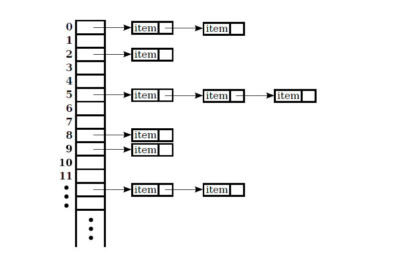

# Liste Associative

Esempio liste associative, prima implementate con un'array. Vedi [base.PhoneDirectory](./scr/base/PhoneDirectory.java) e [base.TestPhoneDirectory](./scr/base/TestPhoneDirectory.java).

Nel package `withMap`è implementata utilizzando `java.util.HashMap<K,V>` per implementare la `java.util.Map<K,V>`. Vedi [withMap.PhoneDirectory](./scr/withMap/PhoneDirectory.java) e [withMap.TestPhoneDirectory](./scr/withMap/TestPhoneDirectory.java).

ALtro esempio di utilizzo nel package `addresslist` per un sistema di lista associativa tra clienti, come chiave, e indirizzo, come valore.

Necessita per la classe Customer di reimplementare i metodi `equals()` e `hashCode()` per garantire corretto funzionamento  nella **hash table**. 
.

Il metodo **hashCode()** della classe chiave, costituisce restituice valore intero della funzione di hash.

```java
package addresslist;

public class Customer {
	
	private final String name;
	private final String surname;
	
	public Customer(String name, String surname) {
		this.name = name;
		this.surname = surname;
	}

	public String getName() {
		return name;
	}

	public String getSurname() {
		return surname;
	}
    
	@Override
	public int hashCode() {
		final int prime = 31;
		int result = 1;
		result = prime * result + ((name == null) ? 0 : name.hashCode());
		result = prime * result + ((surname == null) ? 0 : surname.hashCode());
		return result;
	}
	
	@Override
	public boolean equals(Object obj) {
		if (this == obj)
			return true;
		if (obj == null)
			return false;
		if (getClass() != obj.getClass())
			return false;
		Customer other = (Customer) obj;
		if (name == null) {
			if (other.name != null)
				return false;
		} else if (!name.equals(other.name))
			return false;
		if (surname == null) {
			if (other.surname != null)
				return false;
		} else if (!surname.equals(other.surname))
			return false;
		return true;
	}
	
	@Override
	public String toString() {
		return "Customer [name=" + name + ", surname=" + surname + "]";
	}
	
}

```


